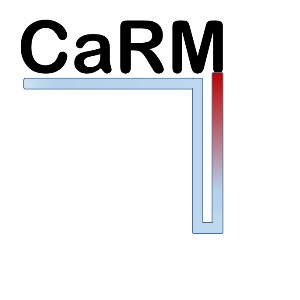
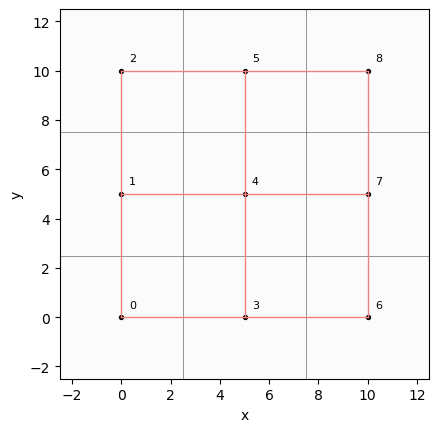

<p align="center">
  
</p>

# CaRM

**CaRM** (Capacity Resistance Model) is a Python library for the simulation of 
borehole heat exchanger (BHE) systems. It models the transient thermal response 
of the ground and borehole, supporting single and multi-borehole configurations 
with surface boundary conditions.

> ⚠️ Work in progress — API may change.

## Features

- Single and multi-borehole field configurations
- Supported BHE types: single U-tube, double U-tube, coaxial, helical
- Ground stratification support
- Surface boundary conditions (solar radiation, sky radiation, convection)
- Voronoi-based field decomposition for multi-borehole layouts
- Finite Line Source (FLS) thermal interference model
- Parallel and series borehole connection modes

## Installation

Clone the repository and install:
```bash
git clone https://github.com/BETALAB-team/CaRM.git
cd CaRM
pip install .
```

**Developers:**
```bash
git clone https://github.com/BETALAB-team/CaRM.git
cd CaRM
pip install -e ".[dev]"
```

## Quick Example

The following example shows a multi-borehole simulation with a single U-tube 
configuration:
```python
import numpy as np
from carm import (
    BoreholeGeometry, BoreholeMesh, BoreholeThermalProperties, SingleUtube,
    GroundGeometry, GroundMesh, PhysicalModel, Simulation, Fluid,
    EnvironmentalProperties, EnvironmentalTimeSeries, FieldInput, Field,
)

# Field layout
myfield = FieldInput(n_bhes=9, xmin=-2.5, ymin=-2.5, xmax=12.5, ymax=12.5, rb=0.075)
myfield.from_excel("field.xlsx")

# Fluid
fluid = Fluid(k_w=0.569, rho_w=1000.1, cp_w=4207.4, ni_w=1.496e-6)

# Borehole
borehole = SingleUtube(
    geom=BoreholeGeometry(Lbore=100, D0=0.15),
    mesh=BoreholeMesh(m_mesh=40),
    thermalprops=BoreholeThermalProperties(cp_0=1460, rho_0=1655, k0=1.8),
    fluid=fluid,
    Rp0=0.25, RppB=0.72,
    pipe_spacing=0.0823, pipe_thick=0.003,
    Dpi=0.026, n_pipes=2,
)

# Ground
ground_geom = GroundGeometry(D0=0.15, L=100, L_sup=1, L_inf=10, rn=None)
ground_mesh = GroundMesh(n_mesh=20, m_mesh=40, m_mesh_sup=4, m_mesh_inf=40, segments=8)

# External environment
env_props = EnvironmentalProperties(
    R_ext=0.04, absorptance=0.7, eps=0.95,
    At=10, tau=0, tau_y=31536000, tau_shift=18144000,
)
env_input = EnvironmentalTimeSeries.from_array(
    Tm=13,
    T_ext=np.full(276, 5.0),
    SolarRad=np.full(276, 150.0),
)

# Physical model
model = PhysicalModel(
    ground_geom=ground_geom, ground_mesh=ground_mesh,
    borehole=borehole, fluid=fluid,
    Tg=13, stratification=[(1.8, 947.37, 1900, 111)],
    fieldinput=myfield,
)

# Simulation
n_steps = 276
sim = Simulation(
    model=model, envprops=env_props, envinput=env_input,
    timesteps=3600, n_steps=n_steps,
    mw_tot=np.full((9, n_steps), 0.1657),
    Tf1=np.full((9, n_steps), 2.0),
)
T_history = sim.run(parallel=True)
```

## Field Visualization

For multi-borehole configurations, before running the simulation it is recommended
to visualize the field layout to identify the borehole indices and the Voronoi
neighbor graph:
```python
model.field.plot_field(show_ids=True, show_graph=True)
```

This allows you to correctly order the inlet temperature and flow rate arrays
(`Tf1` and `mw_tot`) according to the borehole numbering. The neighbor graph
(red edges) shows which boreholes can be linked in series via the `groups`
parameter of `Simulation`.



## Examples

Complete working scripts for all supported configurations are available in the
`examples/` folder:

- `SingleUtube_multi_parallel.py` — multi-borehole field, parallel mode
- `SingleUtube_multi_series.py` — multi-borehole field, series mode
- `SingleUtube.py` — single borehole, single U-tube
- `DoubleUtube.py` — single borehole, double U-tube
- `Coaxial.py` — single borehole, coaxial
- `Helical.py` — single borehole, helical

Each script includes result plots and documents how to extract temperatures
from the output array `T_history`.

## Documentation

To build the documentation locally, install the documentation dependencies first:
```bash
cd CaRM
pip install -e ".[docs]"
```
Then build:
```bash
cd docs
make html
```
The HTML documentation will be available in `docs/_build/html/`.

## Authors

Developed at **BETALAB** – Department of Industrial Engineering, University of Padova.

- Alessio Tollin
- Angelo Zarrella

## Citation

If you use CaRM in your research, please cite:
```
[Citation will be added after publication]
```

This library is based on the following works:

- De Carli, M., Tonon, M., Zarrella, A., Zecchin, R. (2010). *A computational 
  capacity resistance model (CaRM) for vertical ground-coupled heat exchangers.* 
  Renewable Energy, 35(7), 1537–1550. 
  https://doi.org/10.1016/j.renene.2009.11.034

- Zarrella, A., Scarpa, M., De Carli, M. (2011). *Short time step analysis of 
  vertical ground-coupled heat exchangers: The approach of CaRM.* 
  Renewable Energy, 36(9), 2357–2367. 
  https://doi.org/10.1016/j.renene.2011.01.032

- Zarrella, A., De Carli, M. (2013). *Heat transfer analysis of short helical 
  borehole heat exchangers.* Applied Thermal Engineering, 61(1-2), 34–47. 
  https://doi.org/10.1016/j.applthermaleng.2013.08.011

- Zarrella, A., Capozza, A., De Carli, M. (2013). *Analysis of short helical 
  and double U-tube borehole heat exchangers: A simulation-based comparison.* 
  Applied Energy, 112, 358–370. 
  https://doi.org/10.1016/j.apenergy.2012.09.012

- Najib, A., Zarrella, A., Narayanan, V., Grant, P., Harrington, C. (2019). *A revised 
  capacitance resistance model for large diameter shallow bore ground heat exchanger.* 
  Applied Thermal Engineering, 162, 114305. 
  https://doi.org/10.1016/j.applthermaleng.2019.114305

- Claesson, J., Javed, S. (2011). *An analytical method to calculate borehole fluid 
  temperatures for time-scales from minutes to decades.* 
  ASHRAE Transactions, 117(2), 279–288.

- Cimmino, M., Bernier, M. (2014). *A semi-analytical method to generate g-functions 
  for geothermal bore fields.* International Journal of Heat and Mass Transfer, 70, 
  641–650. https://doi.org/10.1016/j.ijheatmasstransfer.2013.11.037

- Cimmino, M. (2018). *pygfunction: an open-source toolbox for the evaluation of 
  thermal response factors for geothermal borehole fields.* 
  Proceedings of eSim 2018, Montréal, Canada, 492–501.

## License

MIT License — see [LICENSE](LICENSE) for details.