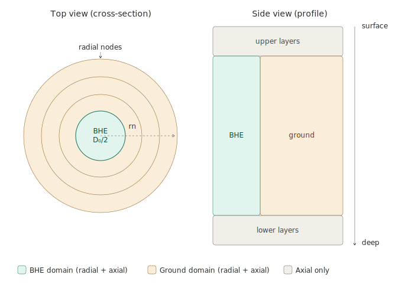

Discretization
==============

The simulation domain is discretized into four zones along the borehole depth. 
Upper and lower layers are axial only, while the ground and borehole domains 
are discretized both axially and radially.

Overview
--------

Upper layers
------------

Axial nodes only — no radial discretization. Each node represents a single
temperature for the ground above the active borehole section. These layers
account for the thermal mass between the surface and the borehole top. The 
upper node is the surface one.

Ground domain
-------------

``m_mesh`` axial layers, each containing ``n_mesh`` radial nodes. The domain
extends radially from the borehole wall to the far-field boundary ``rn``.
Stored row-major: all ``n_mesh`` radial nodes of axial layer 0, then layer 1,
and so on.

Borehole domain
---------------

``m_mesh`` axial nodes, each described by a local system of ``n_equations``,
known basing on the chosen configuration. The number of equations and their 
positions within each node block depend on the BHE type:

.. list-table::
   :header-rows: 1
   :widths: 20 10 10 10 10 10 10

   * - BHE type
     - n_equations
     - shell
     - core
     - shell middle
     - fluid down
     - fluid up
   * - SingleUtube
     - 6
     - 0
     - 1
     - n.d.
     - 4
     - 5
   * - DoubleUtube
     - 10
     - 0
     - 1
     - n.d.
     - 8
     - 9
   * - Coaxial
     - 5
     - 0
     - n.d.
     - n.d.
     - 3
     - 4
   * - Helical
     - 7
     - 0
     - 1
     - 2
     - 5
     - 6

The offsets ``n_equations - 2`` and ``n_equations - 1`` always point to
fluid down and fluid up respectively. If the BHE
is Coaxial or Helical, check which is the inlet pipe to adjust indexes.

Lower layers
------------

Axial nodes only — no radial discretization. Symmetric to the upper layers,
representing the deep ground below the active borehole section.

Initial and boundary conditions
--------------------------------

The initial temperature field and the far-field boundary condition are both
derived from the Kusuda-Achenbach analytical model [Kusuda1965]_. At the
start of the simulation, every node in the domain is initialised with the
temperature predicted by this model at the corresponding depth and time. The
same profile is used as the far-field radial boundary condition at ``rn`` for
single-borehole mode throughout the simulation, so the outer boundary always
follows the undisturbed seasonal ground temperature cycle rather than a fixed
value.

In multi-borehole mode (with series connection or irregular spacing) the 
far-field boundary is updated at each timestep by the FLS thermal interference 
model (see :doc:`fls_methods`), which adds thevinter-borehole temperature 
perturbation on top of the Kusuda-Achenbach baseline. If the boreholes are
regularly spaced and connected in parallel, the adiabatic condition will be 
used at mid-distance between adjacent boreholes.

.. [Kusuda1965] Kusuda, T., Achenbach, P.R. (1965). *Earth temperature and 
   thermal diffusivity at selected stations in the United States.* 
   ASHRAE Transactions, 71(1).