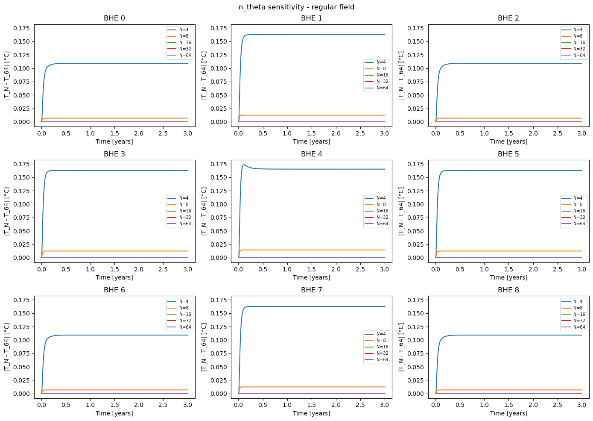
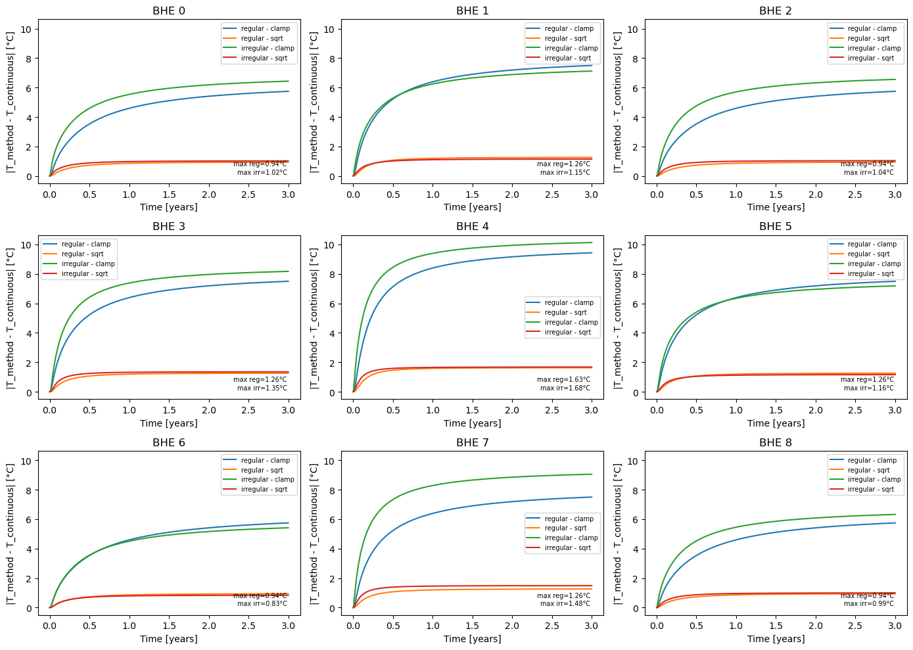
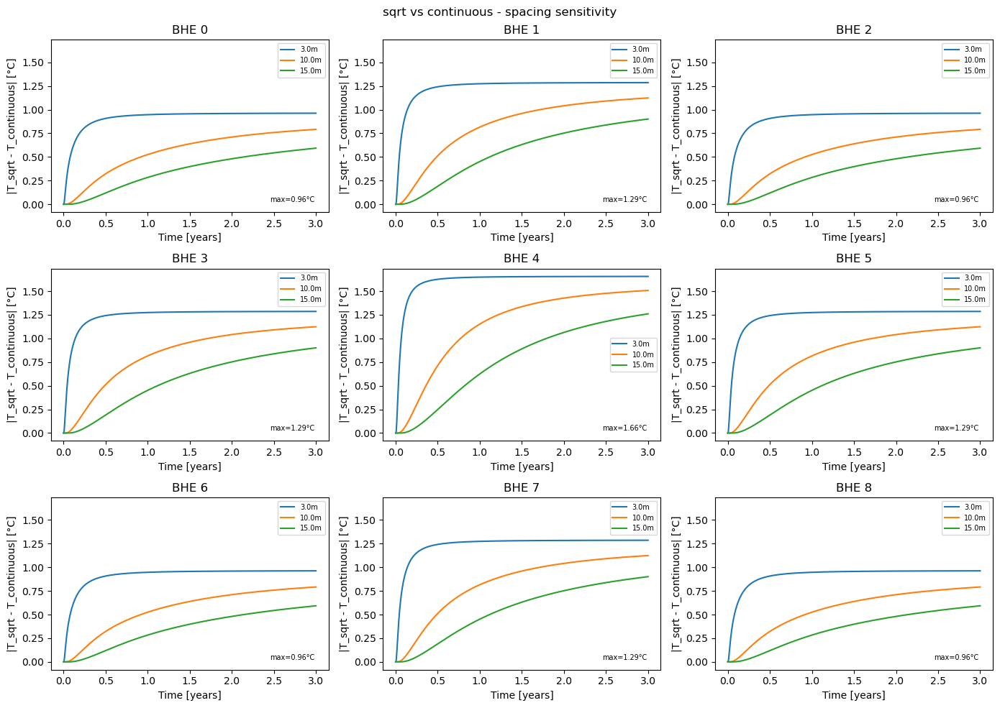

FLS Calculation Methods
=======================

CaRM precomputes a thermal response matrix using the Finite Line Source (FLS)
analytical model. Two methods are available to evaluate the effective distance
between boreholes, controlled by the ``fls_mode`` parameter of
:class:`~carm.simulation.Simulation`.

Overview
--------

Each borehole is assigned a Voronoi cell of area :math:`A_i`, from which an
equivalent radius is derived:

.. math::

   r_{eq,i} = \sqrt{\frac{A_i}{\pi}}

This radius represents the effective influence area of borehole :math:`i` and
is used to compute the distance entering the FLS integral. Two strategies are
implemented.

sqrt method (default)
---------------------

The effective distance between source borehole :math:`j` and receiver borehole
:math:`i` is computed as:

.. math::

   d_{ij} = \sqrt{d_{Euclidean,ij}^2 + r_{eq,i}^2}

where :math:`r_{eq,i}` is the equivalent radius of the **receiver** cell. This
is a scalar approximation — a single distance value per borehole pair — and is
the default method due to its low computational cost.

continuous method
-----------------

The receiver borehole wall is discretized into :math:`N_\theta` equally spaced
points along its equivalent radius:

.. math::

   \mathbf{p}_k = (x_i + r_{eq,i}\cos\theta_k,\ y_i + r_{eq,i}\sin\theta_k),
   \quad \theta_k = \frac{2\pi k}{N_\theta},\ k = 0, \ldots, N_\theta - 1

The FLS response is evaluated at each point and averaged:

.. math::

   \bar{h}_{ij} = \frac{1}{N_\theta} \sum_{k=0}^{N_\theta - 1} h(d_{ijk})

where :math:`d_{ijk}` is the distance from source :math:`j` to point
:math:`k` on receiver :math:`i`. This method is more accurate but
significantly more expensive.

Angular discretization sensitivity
~~~~~~~~~~~~~~~~~~~~~~~~~~~~~~~~~~~

The figure below shows the absolute difference between results at
:math:`N_\theta` and the reference solution at :math:`N_\theta = 64`, for a
regular 9-borehole field over 3 years.

From :math:`N_\theta = 8` onward, the error is below 0.01 °C across all
boreholes. The default value is therefore set to :math:`N_\theta = 8` as the
best compromise between accuracy and computational cost.

Method comparison
-----------------

The figures below compare the two methods against the continuous reference
solution over a 3-year simulation on a 9-borehole field.

Absolute error vs continuous
~~~~~~~~~~~~~~~~~~~~~~~~~~~~~

The clamp strategy produces errors up to 10 °C for central boreholes and is
not recommended. The sqrt method stays within approximately 1.7 °C across all
boreholes and both regular and irregular layouts, making it suitable as the
default method.

Spacing sensitivity
~~~~~~~~~~~~~~~~~~~~

The error between sqrt and continuous decreases as borehole spacing increases.
For spacings of 10 m and above, the maximum error is below 1 °C over 3 years.
At tight spacings (3 m), the error can reach approximately 1.6 °C for central
boreholes.

Choosing a method
-----------------

.. list-table::
   :header-rows: 1
   :widths: 20 40 40

   * - ``fls_mode``
     - Accuracy
     - Cost
   * - ``"sqrt"``
     - Max error ~1.7 °C over 3 years
     - Low — single distance per pair
   * - ``"continuous"``
     - Reference solution
     - High — scales with :math:`N_\theta \times n_{BHE}^2 \times n_{steps}`

Use ``"sqrt"`` (default) for parametric studies and large fields. Use
``"continuous"`` when high accuracy is required and the field is small.